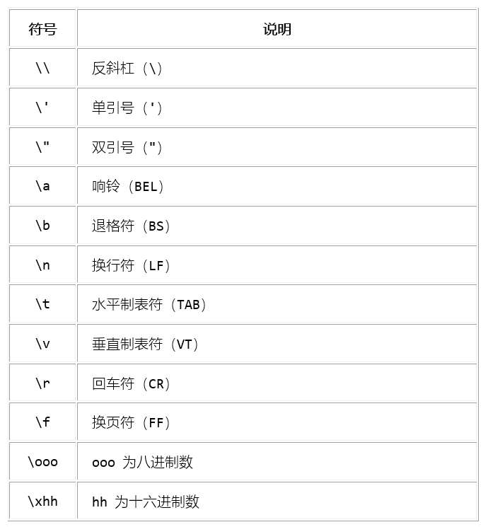

# 一、初识python
  
## 1.1 python的开发环境
  
python是一门语言，常用IDE（集成开发环境）有pycharm和spyder，网页交互式编译器jupyter。还有一个是anaconda，属于python系列软件的打包软件。
  
## 1.2 python的特征
  
python 最具特色的就是用缩进来写模块。缩进的空白数量是可变的，但是所有代码块语句必须包含相同的缩进空白数量，这个必须严格执行。比如：
  
```{r eval=FALSE, include=TRUE}
if True:
    print ("Answer")
    print ("True")
else:
    print ("Answer")
    # 没有严格缩进，在执行时会报错
    print ("False")
```

### Python的小优点（print函数）

互换两个数的值可以用以下优雅的代码实现：

```{r eval=FALSE, include=TRUE}
x=3
y=5
x,y=y,x
#print输出一个路径可以使用原始字符串或者转义字符
print("D:\\mydata\\notebook.txt")
print(r"D:\mydata\notebook.txt")
#长字符串（也可以用3个单引号，但要前后对应）
poetry = """
面朝大海
春暖花开

这是一首优美的诗歌
"""
print(poetry)
```





## 1.3 python变量类型
  
标准数据类型有：Numbers——数字（整型int与长整型long、浮点型float、复数complex）、String——字符串、List——列表、Tuple——元组、Dictionary——字典
  
python特有的结构主要是三种：列表、元组与字典。
  
### 1.3.1 list列表
  
列表是最常见的一种数据形式，可以把大量地数据放到一起。它是以方括号"[ ]"包围的数据集合，不同成员之间用半角逗号相隔开。列表可以包含任何数据类型，也可以包含一个列表。列表也可以通过序号访问其中的成员。
  
```{r eval=FALSE, include=TRUE}
alist = ['a','1','b',2.0]#创建一个包含不同元素的列表
alist[2]#访问第三个元素
[1,2] + [3,4]#支持加法运算，等于[1,2,3,4]
[1] * 3#支持乘法运算，等于[1,1,1]
```
  
python中有多种对列表的操作函数，如下：
```{r eval=FALSE, include=TRUE}
list.append(x)#在列表尾部追加成员x
list.count(x)#返回参数x出现的次数
list.extend(L)#向列表中追加另一个列表L
list.index(x)#返回参数x在列表中的序号
list.insert(index,object)#向列表中指定位置插入数据
list.pop()#删除尾部成员并返回被删除的成员
list.remove(x)#删除x，多个则只删除第一个
list.reverse()#顺序颠倒
list.sort()#对成员排序，要求可排序
```
  
### 1.3.2 tuple元组
  
元组可以看成是特殊的列表，一经建立就不能改变。
  
```{r eval=FALSE, include=TRUE}
atuple = (1,2,3)#创建一个元组
atuple[1]#引用第二个元素
```
  
### 1.3.3 dictionary字典
  
字典是一堆无序的成员的集合，每个成员以“键——key：值——value”的形式存在。通过键来访问成员，而不能通过位置来访问。
  
```{r eval=FALSE, include=TRUE}
adct = {'a':1,'b':2,'c':3.4}#创建一个字典
adct['a']#用键名来引用成员
#python中对字典有很多操作函数
dic.clear()#清空字典
dic.copy()#复制字典
dic.get(k,default=“defau”)#获取k对应的值，不存在则返回defau
dic.items()#获得由键和值组成的迭代器
dic.keys()#获得键的迭代器
dic.pop(k)#删除k:v成员对
dic.update(adict)#从另一个字典更新成员（存在则覆盖，不存在则增添）
dic.values()#获得值的迭代器
dic.fromkeys(iter,value)#以列表或元组中给定的键建立字典，默认值为value
dic.popitem()#从字典中删除任一k:v并返回它
dic.setdefault(k,default)#若字典中存在key值为k的，则返回其对应的值，
#否则在字典中建立一个k:default字典成员
```
  
  
字典的创建常用for循环与zip()函数，zip()函数用于将多个序列中的元素配对，输出为元素为“对”的元组。

字典的键不能是列表。
  
### 1.3.4 集合

py的变量类型还有集合。集合有以下特征：

\begin{itemize}

\item 集合是一种无序集，是键的集合而不存储值

\item 集合不允许重复的键

\item 集合可以进行数学集合的运算

\end{itemize}

## 1.4 流程控制语句

### 1.4.1 if语句

```{r eval=FALSE, include=TRUE}
num = 5     
if num == 3:            # 判断num的值
    print 'boss'        
elif num == 2:
    print 'user'
elif num == 1:
    print 'worker'
elif num < 0:           # 值小于零时输出
    print 'error'
else:
    print 'roadman'     # 条件均不成立时输出
```
  
### 1.4.2  循环

```{r eval=FALSE, include=TRUE}
for letter in python:
  print("the letter is:" % letter)


```


  
  
  
  
  
  

